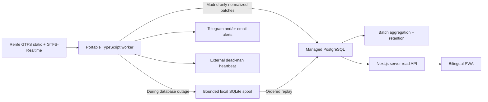
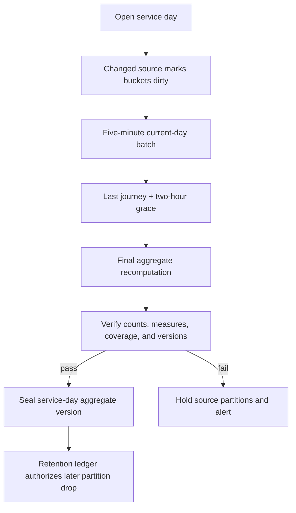

# Atodotren MVP Implementation Plan

Status: Milestones 0, 1, 2, and 3 accepted; Milestone 2.1 notification-correctness follow-up complete
Scope: Madrid Cercanías data foundation first; read-only bilingual PWA second
Working name: Atodotren

## 1. Outcome

Build a cheap, portable ingestion and PostgreSQL system that continuously records Renfe-reported Cercanías performance for Madrid, preserves exact recent journeys, and converts older records into compact, mergeable historical statistics.

The first implementation target is not the public frontend. It is a trustworthy database that can ingest a representative pilot, expose data-quality problems, prove its storage cost, and answer the queries required by the future live and historical pages.

## 2. Non-negotiable product rules

- Madrid only during the MVP. National feed entities are parsed in memory and discarded unless they can be assigned to the Madrid network.
- The model is network-aware from the first migration so another Cercanías network can be added through a focused configuration/code mapping addition, without redesigning the schema.
- PostgreSQL is the source of truth. It must remain standard managed PostgreSQL without a required time-series or provider-specific extension.
- Renfe's `arrival.time` is an absolute reported event estimate. It is not our capture timestamp and is not guaranteed to be an observed actual arrival.
- Renfe's `arrival.delay` is a signed schedule deviation in seconds. When both fields exist, `arrival.time` is authoritative for the expected-arrival instant, following GTFS-Realtime.
- Preserve `arrival.delay`, the delay derived from `arrival.time`, and their difference for audit during the detailed retention window.
- `STOPPED_AT` is evidence that Renfe considered the vehicle stopped at a stop at the vehicle-position timestamp. It is not an exact arrival timestamp.
- Historical results may include stop-specific Renfe reports without `STOPPED_AT`, but they must be classified as `reported_only`. First captured stopped presence is classified separately as `observed_presence`.
- A delay propagated from an upstream stop is a live prediction only. It never becomes a historical stop observation.
- Cancellations, skipped stops, missing evidence, and feed outages are never folded into the delay distribution.
- Punctual means an arrival delay of at most 120 seconds. A delay of 121 seconds is late.
- Store and calculate delays as integer seconds. Round only for presentation.
- Spanish and English are supported from the first public release; Spanish is the default.

## 3. System boundary



The browser never connects directly to PostgreSQL or a database-provider API. The Next.js server is the sole public data boundary.

### 3.1 Provider-neutral PostgreSQL contract

The implementation targets stock PostgreSQL, not a Supabase, Neon, Railway, Render, or other provider SDK/API.

- Database access uses PostgreSQL wire-protocol connection strings and standard SQL only.
- Runtime accepts `DATABASE_URL`; migrations may use a separate `MIGRATION_DATABASE_URL` when a provider recommends a direct or session connection for DDL.
- TLS mode and optional CA certificate path are configuration, never hard-coded provider behavior.
- No Supabase client library, Data API, authentication product, edge function, provider migration API, or required provider extension belongs in the ingestion path.
- All application objects live in the dedicated private schemas defined below, not an exposed provider `public` schema.
- Provider-specific examples may explain how to obtain the correct URLs, but cannot change migrations or application code.
- The same migrations and worker image must pass against a pinned local official PostgreSQL container before they are permitted to run against managed PostgreSQL.
- PostgreSQL 16 is the minimum supported major and PostgreSQL 18 is the primary local major for Milestone 0. CI runs the same database contract against exact pinned patch images for both majors. A selected managed provider's actual major must pass that contract before use.

For Supabase specifically, a persistent Pi/container may use a direct connection when IPv6 is available or Supavisor session mode when the network is IPv4-only. Transaction pooling is not the default for the long-running worker or schema migrations. These are connection-string choices, not a Supabase implementation.

### 3.2 Deployable MVP acceptance outcome

Implementation of this plan is not complete until a user can:

1. Copy `example.env` to an untracked environment file.
2. Set standard PostgreSQL connection values for a managed database such as Supabase.
3. Optionally enable Telegram, email, or both.
4. Create the bounded persistent spool volume.
5. Run the documented Docker Compose bootstrap command.
6. Have migrations applied, the current Madrid static feed imported, health checks pass, and continuous real Renfe ingestion start without editing source code.

Provide a Pi-oriented Compose example, but keep it ordinary Docker Compose so it also works on any Linux Docker host. The quick start must include verification commands for database connectivity, active static-feed version, latest successful poll, queue state, and heartbeat.

## 4. Repository shape

Use a TypeScript monorepo. The exact package manager can be selected during scaffolding, but the intended boundaries are:

```text
apps/
  web/                    Next.js PWA and server read API
  worker/                 long-running ingestion/aggregation CLI
packages/
  config/                 validated environment and network configuration
  db/                     Kysely types, connection pools, query modules
  domain/                 evidence, delay, service-day, and status rules
  gtfs-static/            static ZIP parsing, filtering, and matching
  gtfs-realtime/          protobuf decoding and normalization
  analytics/              mergeable measures and histogram implementation
  observability/          logs, health, reports, alerts, heartbeat
migrations/               ordered, explicit PostgreSQL SQL migrations
docker/
  worker/                 multi-stage worker image
```

Use Kysely over `node-postgres` for typed application queries. Keep migrations and advanced partition/aggregation definitions explicit in SQL. Raw SQL remains available for batch operations and analytical queries.

## 5. Deployable worker

Build one OCI image for `linux/amd64` and `linux/arm64`. It must not assume Raspberry Pi hardware, even though a Pi 5 is a reasonable first host.

Commands:

- `worker ingest`: continuous real-time polling and persistence
- `worker import-static`: conditional download, validation, filtering, and activation
- `worker aggregate`: idempotently recompute dirty aggregate buckets
- `worker finalize`: close eligible service days and mark retention prerequisites
- `worker replay`: replay the local outage spool
- `worker doctor`: verify configuration, database permissions, feeds, clock, and storage
- `worker report`: emit concise Markdown and JSON operational/data-quality reports

For deployment and bounded testing, ingestion also supports `--once` and `--cycles <n>` modes. Continuous ingestion remains the production default.

Provide:

- `Dockerfile` and multi-architecture build configuration
- Docker Compose for local PostgreSQL plus worker
- `example.env` with documentation for every value
- health check and graceful shutdown
- migrations as a separate deployment/startup step
- optional persistent volume for the outage spool
- no secrets baked into an image
- a Compose bootstrap sequence that runs migrations, conditionally imports static GTFS, and starts ingestion only after both succeed
- a Pi deployment guide covering image selection, persistent volume, environment configuration, startup, verification, upgrades, rollback, logs, and safe shutdown

## 6. Source polling

### 6.1 Static GTFS

Source: `https://ssl.renfe.com/ftransit/Fichero_CER_FOMENTO/fomento_transit.zip`

- Check daily at approximately 04:00 Europe/Madrid.
- Use `ETag` and `Last-Modified`; download only when changed.
- Calculate SHA-256 and treat every changed import as an immutable feed version.
- Parse the national ZIP as a stream or in bounded chunks.
- Persist only Madrid routes, trips, stops, stop times, shapes, calendar records, and required relationships.
- Load into staging tables, validate, run matching canaries, and activate transactionally.
- Keep the previous active version available for real-time matching fallback.
- Reject a new version without disturbing the active one when validation fails.

The import must handle GTFS service times beyond 24:00 and must not assume `calendar_dates.txt`, `direction_id`, or `feed_info.txt` exists.

### 6.2 GTFS-Realtime

Production uses protobuf:

- trip updates every 30 seconds
- vehicle positions every 30 seconds, in the same poll cycle
- service alerts every 60 seconds
- JSON only for manual diagnosis

Rules:

- Do not overlap poll cycles.
- Retry one transient network or 5xx failure after 3-5 seconds of jitter.
- Do not repeatedly retry 4xx responses.
- Record our `captured_at`, feed header timestamp, entity timestamp when present, response duration, response size, and result classification separately.
- A malformed entity is quarantined minimally while valid entities from the same feed continue.
- Reject the entire response only when its framing, protobuf structure, or header makes it unusable.
- Emit a heartbeat only after a successful poll and persistence cycle.

### 6.3 Madrid filter

Create an explicit network configuration that maps the active and previous Madrid static-feed entities to the stable Madrid network.

For each real-time entity:

1. Resolve its trip against the active static version.
2. Fall back to the previous version when uniquely defensible.
3. Use configured route/service-pattern matching only when it produces one unambiguous result.
4. Persist the normalized entity only if it resolves to Madrid.
5. Count but do not retain unknown or non-Madrid payloads.
6. Quarantine ambiguous Madrid candidates minimally; never guess a journey match.

## 7. PostgreSQL schemas and roles

Schemas:

- `gtfs_static`: immutable, versioned Madrid static-feed facts
- `ingest`: short-lived source evidence, poll records, quarantine, and live state
- `core`: stable product dimensions plus 30-day canonical journeys
- `analytics`: long-lived aggregate facts, dirty buckets, and aggregation runs
- `api`: stable read views/functions used by the web server
- `operations`: health, retention ledger, alerts, and compact operational summaries

Database roles:

- `atodotren_migration_admin`: schema changes only; never a runtime credential
- `atodotren_ingest_writer`: required writes and reads for the worker
- `atodotren_web_reader`: select only from approved `api` objects
- `atodotren_backup_reader`: read access required for logical backups
- `atodotren_monitor_reader`: health and diagnostic views only

Group roles are project-prefixed, `NOLOGIN`, and must have no superuser, role creation, database creation, replication, or row-security-bypass attributes. The migration login receives non-inherited, set-only membership in `atodotren_migration_admin`; the migration runner assumes that owner role for every migration transaction so rotating the login cannot change object ownership or default privileges.

Revoke default public schema access, use TLS, rotate credentials, and use provider connection pooling. Keep web and worker pools small and independently limited.

## 8. Data model

The names below are the implementation baseline. Migrations may refine column names, but must preserve the boundaries and uniqueness rules.

### 8.1 Stable product dimensions in `core`

#### `network`

- `id bigint identity primary key`
- stable `slug` such as `madrid`
- localized name
- operational timezone (`Europe/Madrid`)
- active flag

#### `station`

- stable product station independent of one GTFS version
- public bilingual slug and localized names
- optional schematic coordinates
- active dates

Platform or stop-level GTFS records map to one canonical station. Historical long-term statistics use the station, not platform IDs.

#### `line`

- stable public line such as C-4
- network foreign key
- bilingual slug/name and display metadata

#### `branch`

- stable branch beneath a public line
- route endpoints and display order
- active dates

#### `service_pattern`

- branch, direction, ordered stop pattern, and content hash
- minor stopping variations may share a matrix corridor; genuinely divergent itineraries use separate patterns

#### `segment`

- directed adjacent station pair within a service pattern
- stable upstream/downstream station references

All foreign-key columns used for joins receive supporting indexes. Public URLs use stable slugs or opaque public identifiers, never internal sequences.

### 8.2 Versioned static facts in `gtfs_static`

#### `feed_version`

- network, source URL, checksum, fetch metadata
- import status and validation result
- effective/activation timestamps
- immutable after successful import

#### Versioned GTFS tables

- `stop`
- `route`
- `trip`
- `stop_time`
- `calendar_service`
- `shape_point`

Each row references `feed_version`. Mappings connect GTFS stop/route/trip facts to stable station, line, branch, and service-pattern dimensions. Store scheduled arrival/departure as integer seconds since service-day midnight, allowing values beyond 86,400.

### 8.3 Ingestion and live state in `ingest`

#### `poll_run`

One compact record per feed request:

- feed kind
- started/completed/captured/provider timestamps
- HTTP/result classification
- bytes and entity counts
- Madrid/matched/unmatched/invalid counts
- response and persistence durations
- compact error code

Daily partition; retain detailed records for 30 days, then roll into hourly/daily operations summaries.

#### `filtered_payload`

- compressed Madrid-only response subset needed for short replay/debugging
- feed kind, captured timestamp, checksum, and codec version

Daily partition; retain 48 hours. Never store the full national response.

#### `stop_evidence`

Append-only changed evidence only:

- trip/stop source identifiers and resolved journey-stop key
- reported arrival time and delay when changed
- first relevant vehicle status transition
- cancellation/skip state transitions
- source and capture timestamps
- matching and evidence classification

Daily partition; retain 7 days. Do not store identical repeated predictions, every repeated `STOPPED_AT`, long GPS histories, or duplicated labels.

#### `quarantined_entity`

Minimal source identifiers, reason code, timestamps, and only the fields required to diagnose matching/parsing. No national payload retention. Retain with detailed operations data for at most 30 days.

#### `live_vehicle_state`

One upserted current state per active Madrid journey/vehicle:

- latest position/status/stop
- latest stop-specific reported delay
- projected schematic position and confidence
- freshness timestamps

This is replaceable live state, not history. Remove shortly after journey closure.

### 8.4 Recent canonical journeys in `core`

#### `journey`

Daily partition by `service_date`; retain 30 completed service days.

- network and service date
- source trip identifier plus start date/time where available
- feed version and resolved service pattern
- line, branch, and direction
- scheduled service-day start/end
- trip relationship and lifecycle status
- matching algorithm/version and confidence

Natural uniqueness includes network, service date, and the resolved trip instance. Do not assume a `trip_id` is globally unique or stable between static versions.

#### `journey_stop`

Daily partition by `service_date`; retain 30 completed service days.

One row per scheduled arrival stop:

- journey and stop sequence
- stable station plus original versioned GTFS stop
- scheduled arrival seconds and derived `timestamptz`
- Renfe-reported `arrival.time`
- Renfe-provided `arrival.delay`
- delay derived from reported time and matched schedule
- difference between provided and derived delay
- first valid `STOPPED_AT` presence timestamp, when captured
- selected canonical delay seconds
- status: reported, observed presence, skipped, canceled, or missing evidence
- evidence type, freshness, and uncertainty estimate
- feed version and matching/algorithm version

The first valid stopped-presence evidence is immutable. A prediction-only stop may update until journey finalization. Later changes require an explicit repair run with a new algorithm or matching version; never silently rewrite evidence.

If a journey is explicitly canceled after operating ten stops, those ten stops remain normal. Only later scheduled stops become canceled. A journey disappearance is missing evidence, never a cancellation.

### 8.5 Alerts in `core`

Normalize Renfe service alerts, their active intervals, affected entities, text, source identifiers, and change history. Retain long-term as operational context, never as proof that an alert caused a measured delay.

## 9. Service-day and time rules

- `service_date` from the GTFS-Realtime trip descriptor is authoritative.
- Keep scheduled time as `(service_date, seconds_since_service_day_start)`; seconds may exceed 86,400.
- Derive instants using the network's IANA timezone and store them as `timestamptz`/UTC.
- Scheduled hour and weekday filters use the derived Europe/Madrid wall-clock instant. The public hour is always 0-23 even when its raw GTFS service-day seconds exceed 86,400.
- A service day closes after its last scheduled Madrid journey plus a configurable two-hour grace period.
- Do not finalize at civil midnight.
- Build expected totals and a timetable checksum independently from the complete applicable timetable before materialization; finalization must match that ledger.
- Version holiday/weekend/ordinary-weekday classifications by publication date. Migration-owned 2026 Comunidad de Madrid regional holidays are excluded from ordinary same-weekday baselines by default.

## 10. Canonical arrival selection

For a scheduled arrival stop:

1. Preserve all changed stop-specific Renfe reports during the 7-day evidence window.
2. Use `arrival.time` as the expected-arrival instant when present.
3. Derive delay from the matched scheduled arrival.
4. Preserve `arrival.delay` independently and calculate the discrepancy.
5. Attach first valid `STOPPED_AT` as stronger stopped-presence evidence, without claiming it is the exact arrival instant.
6. Never finalize an upstream propagated delay as evidence for a later stop.
7. If stop-specific evidence never arrives, finalize as missing evidence.
8. Exclude `SKIPPED`, canceled, and missing-evidence rows from delay punctuality distributions.

The selected canonical delay is the delay derived from `arrival.time` when that field and a reliable static match exist; otherwise it falls back to Renfe's provided `arrival.delay`. A discrepancy is retained and reported internally rather than silently reconciled.

For user-facing language, prefer “Renfe-reported arrival/delay.” Only use “observed presence” for captured stopped status, and display its uncertainty/freshness when inspected.

## 11. Long-term aggregate model

Aggregates are computed in batch, never through row-level database triggers. Source changes mark affected buckets dirty; `worker aggregate` recomputes them idempotently.

### 11.1 Daily hourly aggregates retained indefinitely

#### `daily_stop_call_hour`

Grain:

- network
- service date
- station
- line
- branch
- direction
- scheduled service-hour

#### `daily_journey_hour`

Grain:

- network
- service date
- line
- branch
- direction
- scheduled journey-start hour

This table prevents distinct journeys from being double-counted when station results are combined.

#### `daily_segment_hour`

Grain:

- network
- service date
- directed adjacent segment
- line
- branch
- direction
- upstream scheduled service-hour

Segment delay change is signed downstream delay minus upstream delay. Negative values represent recovery and remain valid.

#### `daily_line_summary` and `daily_network_summary`

Small headline tables for fast overviews and rankings. They are derived from the correct statistical unit rather than summing incompatible station-level distinct counts.

### 11.2 Monthly exact-schedule aggregates retained indefinitely

Preserve “How does my particular scheduled train usually perform?” without keeping daily train identity.

Tables:

- `monthly_stop_schedule`
- `monthly_segment_schedule`
- `monthly_journey_schedule`

During an open calendar month, anonymous `daily_schedule_contribution` rows make the monthly build idempotent: one finalized service day can be replaced without double-counting. After the month is sealed and verified, merge its contributions into the monthly tables and delete the temporary daily contributions. These rows contain no journey identifier and never outlive the monthly sealing grace period.

Classified exact-schedule facts are compacted by monthly grain only during the successful delete inside sealing. Blocked attempts write nothing, and the retained classified table has no daily `service_date`, civil date, or row identity.

Grain includes:

- calendar month
- weekday/service-day class
- line, branch, direction, and relevant station/segment
- exact scheduled seconds since service-day midnight
- static schedule lineage needed to distinguish timetable changes

An 08:14 slot that later becomes 08:16 remains a separate slot. The UI may present both when explaining a timetable change. Exact arbitrary old-day drill-down is intentionally unavailable.

### 11.3 Measures stored at each applicable grain

- scheduled opportunities
- valid delay observations
- exact on-time count (`delay_seconds <= 120`)
- early, 0-2, 2-5, 5-10, 10-15, and over-15-minute counts
- canceled, skipped, and missing-evidence counts
- `reported_only` and `observed_presence` counts
- unmatched/ambiguous and time-delay inconsistency counts where applicable
- signed delay sum, squared sum, minimum, and maximum
- mergeable 30-second delay histogram with underflow/overflow
- distinct journey totals only at a grain where they are additive and unambiguous
- source coverage and aggregate algorithm version

The histogram range and compact encoding are finalized from pilot observations. Exact threshold counters remain authoritative; merged median and p90 values are approximate within roughly one histogram interval. Extreme values remain represented through exact min/max/sum and histogram overflow even when outside its encoded range.

## 12. What historical queries remain possible

Indefinitely:

- worst stations, lines, days, hours, directions, and adjacent segments
- station/line/direction/hour performance across arbitrary dates
- punctuality, mean, approximate median/p90, distributions, volume, cancellations, and coverage
- daily, weekly, and monthly trends
- exact scheduled-slot performance across selected months and weekday classes
- evidence-quality and feed-health context

For 30 days only:

- exact train journey drill-down
- stop-by-stop timetable matrices
- arbitrary exact-date and exact-train reconstruction
- exact arbitrary origin-to-destination delay change

For older arbitrary multi-stop routes, combine adjacent-segment aggregates into an explicitly labeled estimate with sample coverage and uncertainty. Do not store every possible origin/destination pair.

## 13. Aggregation, finalization, and deletion gates



Cadence:

- live vehicle and individual train state: every successful 30-second cycle
- current-day aggregates: at most five minutes behind
- recent unfinished prior days: hourly repair pass
- automatic recovery: oldest eligible unverified dates within the retained 35-day timetable/canonical window, with a bounded limit
- finalized days: immutable unless an explicit repair or methodology version is run

Before dropping a 30-day journey partition:

1. Confirm its service day is finalized.
2. Confirm all required daily and monthly aggregate buckets succeeded.
3. Verify source counts against aggregate denominators and status totals.
4. Record aggregate version, row counts, compact checksums, and verification result in `operations.retention_ledger`.
5. Drop the whole daily partition only after verification passes.
6. Hold the partition and alert if any prerequisite fails.

Use PostgreSQL advisory locks so only one importer, finalizer, aggregation run, or retention pass owns a given scope. Keep transactions short and never perform network I/O inside a database transaction.

## 14. Retention policy

| Data | Retention | Removal method |
|---|---:|---|
| Madrid-filtered compressed response subset | 48 hours | Drop daily partition |
| Changed prediction/status evidence | 7 days | Drop daily partition |
| Canonical journey and journey-stop detail | 30 completed service days | Drop verified daily partition |
| Detailed poll/quarantine/operational records | 30 days | Drop daily partition |
| Temporary between-station vehicle positions | Journey lifetime plus short grace | TTL cleanup/upsert replacement |
| Hourly/daily operations coverage summaries | Indefinite | No automatic expiry |
| Daily hourly performance aggregates | Indefinite | No automatic expiry |
| Monthly scheduled-slot aggregates | Indefinite | No automatic expiry |
| Normalized service alerts | Indefinite | No automatic expiry |
| Madrid static-feed versions | Indefinite initially | Review only if measured growth matters |

Partitioning is primarily a retention and maintenance tool. Start with daily partitions only on expiring high-churn tables; do not partition small dimension or aggregate tables without measured need.

## 15. Index strategy

Start with the minimum indexes required by known writes and reads:

- primary/unique keys supporting idempotent upserts
- indexes for every frequently joined foreign key
- composite indexes matching equality dimensions first and date/time range last
- small partial indexes for open journeys, dirty buckets, unresolved matches, and active alerts
- covering indexes only after real query plans show a repeated heap-fetch problem

Do not create one index per possible filter. Validate every important query using `EXPLAIN (ANALYZE, BUFFERS)` against pilot and generated multi-year aggregate volumes. Record index sizes as part of the cost report.

Batch inserts per poll and use atomic `INSERT ... ON CONFLICT` for current state and deduplication. Use `COPY FROM STDIN` for large static imports. Run `ANALYZE` after static activation and large aggregate rebuilds; monitor autovacuum rather than disabling it.

## 16. Local outage spool

Use a small SQLite database on an optional Docker volume as a durable worker-side spool when managed PostgreSQL is unavailable.

- Store normalized, deduplicated pending writes—not national responses or repeated snapshots.
- Preserve stop evidence, cancellations/skips, and alerts before low-value position updates.
- Default hard limit: 1 GB; configurable up to 10 GB.
- Maximum logical backlog: 48 hours.
- Replay in source order with the same idempotency keys used for direct persistence.
- When forced to shed data, discard repeated/low-value vehicle positions first and record exact drop counts.
- Alert on queue growth, shedding, replay failure, and recovery.

The queue is a resilience layer, not another historical database.

## 17. Operations and alerting

Telegram and email are independently configurable; either or both may be enabled.

Urgent alerts:

- approximately three consecutive failed ingest cycles
- heartbeat stale
- static import rejected
- Madrid matching rate collapse
- malformed-entity rate spike
- local queue growth or shedding
- aggregate/finalization verification failure
- retention blocked
- recovery from an alerted failure

Avoid alerting on a single retry. Do not build an internal web dashboard for the pilot; use SQL views, `worker report`, structured logs, and external notifications.

## 18. Backups

- Use managed daily backups.
- Produce a weekly compressed logical export to independent object storage.
- Keep four weekly exports plus monthly checkpoints.
- Prioritize stable dimensions, static versions, canonical data still in retention, long-term aggregates, alerts, and operations metadata.
- Run documented restore tests rather than assuming a backup is usable.

## 19. Read API and caching boundary

The data foundation should expose stable `api` views/functions for the later Next.js server:

- network/line today summary
- live journey and schematic state
- station/line today detail
- historical station/line/segment aggregations with shared filters
- recent matrix source query
- scheduled-slot history
- coverage/methodology metadata
- bounded CSV export source

Cache policy:

- live/current: 30 seconds
- recent unfinalized historical: 5-15 minutes
- finalized historical: at least one hour
- old/static/versioned data: effectively immutable per version
- large CSV: asynchronous or cached generation

Every response carries data freshness, coverage, methodology/aggregate version, and whether results are exact or estimated.

## 20. Implementation milestones

### Milestone 0 — Repository and local runtime

- initialize monorepo and strict TypeScript configuration
- local pinned PostgreSQL in Compose
- Kysely connection layer and explicit SQL migration runner
- environment validation, structured logging, health command
- worker Docker image for amd64/arm64
- CI for typecheck, lint, unit tests, migration smoke test, and container build
- mandatory integration tests against a pinned stock PostgreSQL container, including migrate-up from empty, application queries, and a clean second migration run
- database-contract CI against the minimum PostgreSQL 16 major and primary PostgreSQL 18 major, including role collision, membership rotation, object ownership, and default-privilege tests
- Docker smoke test that starts the complete local Compose stack and verifies health from outside the worker container
- exact direct and transitive role-membership contracts for runtime and migration logins
- one checksummed migration inventory shared by runner, doctor, and preflight, with exact synchronization checks
- failure-safe structured logging, bounded exhaustive shutdown, import-safe CLI dispatch, and clean-before-compile test output

Exit: a clean local PostgreSQL database can be migrated and `worker doctor` passes both on the host and inside the built container. No managed database is touched before this gate passes.

### Milestone 1 — Static Madrid foundation

Status: accepted against the checked-in minimized representative timetable and the
current official RENFE archive. The offline fixture deliberately includes a
same-label non-Madrid route and proves zero national persistence. On 2026-08-17,
the live archive imported in 25.709 seconds at about 550 MiB peak Node RSS,
retaining 118 routes, 37,503 trips, 95 stops, 533,783 stop times, 30 services, and
23 shapes. Madrid uses verified source route prefix `10`; every retained mapping
was covered and the dependency audit found zero unrelated facts.

The acceptance run also fixed and fixture-backed three bounded source variations:
feed-level agency `1071VC` with no per-route `agency_id`, fixed-width whitespace in
CSV headers, and 41 zero-length trip fragments. One consecutive repeated terminal
call remains preserved in versioned stop times but is collapsed in stable topology
so it cannot create a self-segment.

- stable network/station/line/branch/service-pattern schema
- conditional static downloader and checksum versioning
- streaming/bounded national parsing with Madrid-only persistence
- staging validation and transactional activation
- active/previous matching indexes and import report

Exit demonstrated: the representative Madrid timetable reproducibly imports stable
stations, public lines, branches, normalized directions (including absent
`direction_id`), service patterns, ordered stops, directed segments, versioned
trips/stop times above 24:00, calendars, and referenced shapes. PostgreSQL 16.14
and 18.4 tests prove checksum idempotency, active/previous activation, concurrent
serialization, rejected/failed rollback, and zero retained non-Madrid facts.
The original current-timetable exit criterion is demonstrated by the successful
opt-in live import, Madrid-only audit, transactional activation, and doctor result.

### Milestone 2 — Real-time evidence ingestion

- protobuf trip-update, vehicle-position, and alert pollers
- Madrid filtering and active/previous static matching
- compact poll records and filtered 48-hour payloads
- changed-evidence deduplication and quarantine
- live vehicle state and schematic shape projection inputs
- local outage spool, replay, heartbeat, Telegram/email alerts
- deterministic fake HTTP feed server covering normal, stale, malformed, canceled, skipped, missing, delayed, and outage scenarios
- bounded opt-in smoke test against the real Renfe static and protobuf endpoints

Exit: fake-feed tests pass deterministically; the opt-in real-feed smoke test can download/import Madrid static data and persist a small bounded number of real poll cycles into disposable local PostgreSQL; the worker then runs unattended for 48 hours, survives database/network interruption, and replays without duplicate canonical facts.

Implementation verification on 2026-08-17 passed deterministic unit tests,
PostgreSQL 16.14/18.4 contracts, the Compose database-outage/replay smoke, and a
bounded two-cycle live run against all three RENFE protobuf endpoints. The live
run durably stored six compact polls, matched 48 Madrid entities, classified 136
as clear non-Madrid and 682 as unmatched, found zero malformed entities, inserted
12 changed evidence rows, and suppressed 12 identical repeats. No national payload
was retained and explicit replay was empty.

The 48-hour acceptance completed successfully with 14,384 polls, 99.74%
successful coverage, 31.30% aggregate Madrid matching, 0.01% malformed entities,
zero ambiguous matches, 161,793 changed evidence rows, and 435,726 identical
repeats suppressed. It ended with no spool backlog or dropped operations and
approximately 185 MB across realtime ingest/operations relations. The subsequent
Milestone 2.1 corrective pass unified production/test incident handling, isolated
notification episodes, added matching-alert hysteresis, and corrected heartbeat
recovery.

Acceptance readiness requires that command to act as a gate, not only a report:
the worker must still be running, poll volume and successful coverage must meet
configured minima, matching/malformed rates must remain within their operational
thresholds, the final spool must be empty with zero shedding, and no notified
incident may remain unresolved. Pending below-threshold observations remain
diagnostic data but do not fail the gate. The worker also exposes a credential-safe
opt-in `test-notifications` command for real Telegram, SMTP, and heartbeat delivery
checks; it never mutates incident state.

### Milestone 3 — Canonical journeys

- journey and journey-stop daily partitions
- service-day/time conversion including >24:00 and DST tests
- arrival-time/delay audit logic
- stopped-presence classification
- cancellation, skip, disappearance, and partial-cancellation rules
- journey closure and explicit repair versioning

Exit: sampled journeys can be reconstructed and every stop has a defensible status/evidence explanation.

Implemented and verified on 2026-08-22. Migration `0005` adds daily
`core.journey` and `core.journey_stop` partitions, the shared Madrid service-time
conversion boundary, bounded partition creation, closure indexes, immutable first
presence/closed-row guards, repair lineage, least-privilege runtime writes, and a
monitor-only canonical health view. The worker exposes bounded `canonicalize`,
`close-journeys`, and `repair-journeys` JSON commands using short per-journey
transactions and advisory locks. Continuous ingestion invokes bounded canonicalize
and close maintenance after every poll cycle, before any future retention deletion.

The representative PostgreSQL fixture built two journeys and all 18 scheduled
stops. Its four-stop previous-feed journey initially explained one observed stop,
one skipped stop, and two pending stops; arrival-time selection retained a derived
−60 seconds beside Renfe's provided −30 seconds and a +30-second discrepancy.
After its 25:16 service-day end plus two-hour grace, the pending stops became two
`missing_evidence` rows while observed/skipped evidence remained unchanged. Its
explicit `canonical-v2` repair version 1 kept it closed with the same complete
status explanation. In the sparse 14-stop active-feed cancellation fixture, stops
1 and 10 were observed, stops 2–9 became missing evidence, and stops 11–14 became
canceled; no finalized stop remained pending. Concurrent replay produced one
natural-key journey per instance, and direct closed-row, finalized-pending, or
first-presence mutation was rejected. Later provided/exact evidence upgraded an
open journey created from inferred/fallback evidence. Repair discovers closed
journeys directly, advances across repeated bounded calls, and fails explicitly
when their retained evidence is unavailable without starving repairable journeys.

Unit and PostgreSQL tests cover ordinary, >24:00, midnight-crossing, spring-gap,
fall-fold, and descriptor-date conversion; negative delays; reported-time
precedence and provided-delay fallback; discrepancy, stale/duplicate, skipped,
presence, full/partial cancellation, missing-evidence closure, repair, partitions,
permissions, and active/previous lineage. PostgreSQL 16.14 and 18.4 contracts,
the host-architecture image, amd64/arm64 OCI build, and isolated Compose outage/
replay/doctor smoke passed. The live RENFE check and 48-hour acceptance were not
rerun; no Milestone 3 behavior depends on new live-feed claims.

### Milestone 4 — Aggregation and retention

- dirty-bucket tracking and idempotent batch recomputation
- daily hourly aggregate families
- monthly exact-schedule aggregate families
- mergeable histogram and exact punctuality counters
- finalization, sealing, verification, and retention ledger
- partition creation/drop automation

Exit: an expired test partition cannot be dropped before verified aggregates exist; rebuilding yields identical results.

Acceptance report (2026-08-23): implemented and verified on stock PostgreSQL
16.14 and 18.4. Timetable-only trips and completely unseen service days remain in
the denominator; evidence partitions require finalized canonical watermarks and
matching verified checksums; month sealing rejects empty/missing days and stale
daily contributions; public exact-time identity uses civil weekday/wall seconds
while retaining raw GTFS seconds. Classified sealing is transactionally compact and
keeps no daily date grain. Finalization verifies the complete independent timetable
ledger; a confirmed zero-success outage remains visible and seals only after explicit
acknowledgement. Continuous Compose maintenance scans the 35-day retained window and
emits deduplicated finalization warnings. Internal renamed finalization/sealing
functions are not executable by runtime roles. Destructive retention remains explicit
and two-stage. Timetable verification compares stable metric identity—including line,
branch, direction, service pattern, station, stop order, and scheduled time—without
rejecting equivalent active/previous feed lineage.

### Milestone 5 — Two-week evidence pilot

- run continuously on the Pi 5 or another Docker host
- implement `worker report`
- add a configurable low-noise Telegram operational digest, defaulting to daily or disabled
- report poll freshness/coverage, matching, malformed rate, evidence volume, database growth, static-feed age, spool state, and notified incidents
- capture host/resource measurements for the Pi pilot
- inspect Renfe update behavior before and after stops
- measure matching, stop evidence, feed coverage, inconsistencies, outages, and anomalies
- measure table/index/WAL growth and local spool behavior
- replay selected retained payloads through newer code to prove reproducibility
- generate multi-year synthetic aggregate data and test representative queries

Exit: approve or adjust thresholds, histogram range, indexes, provider sizing, and projected annual cost using measured data.

### Milestone 6 — Managed PostgreSQL selection and deployment

- add external dead-man heartbeat monitoring
- add durable per-channel notification/outbox behavior across process crashes
- add managed database/provider monitoring and backup alerts
- compare suitable managed PostgreSQL plans using measured storage, write rate, connection, backup, and egress requirements
- create a reusable provider-neutral role-bootstrap command/SQL artifact, then run the complete PostgreSQL contract against the exact PostgreSQL major and configuration selected at the provider
- deploy migrations and least-privilege roles
- configure pooler, backups, monitoring, and restore test
- move/replay the pilot dataset through the supported import path
- run the same database contract and bounded ingestion smoke tests against the selected managed PostgreSQL instance
- verify the documented Pi Compose bootstrap using the published arm64 image and managed connection strings

Exit: from a clean Pi Docker host and environment file, the documented bootstrap applies migrations, imports Madrid static data, starts continuous real Renfe ingestion, sends configured health alerts, and survives a container restart without manual database intervention. Managed production ingestion also has verified backup and recovery procedures.

### Milestone 7 — Public read API, then frontend

- implement validated, bounded, cached read queries and CSV exports
- add API contract tests and query-plan budgets
- build the bilingual landing, live, and historical PWA pages around real accumulated data
- implement the 30-day matrix and schematic live train view

Exit: public views expose evidence quality and freshness, remain responsive at projected scale, and never require browser database credentials.

## 21. Pilot measurements and release gates

Measure rather than assume:

### Feed and evidence

- successful poll coverage by interval
- Madrid entity matching rate and fallback rate
- malformed/quarantined rate
- proportion of stop calls with stop-specific Renfe evidence
- `reported_only` versus `observed_presence`
- `arrival.time` versus `arrival.delay` discrepancy distribution
- cancellation/skip/missing-evidence rates

Intervals below the provisional 90% successful-poll coverage threshold remain stored but are marked incomplete and excluded from headline rankings. The final threshold is reviewed with pilot evidence.

### Storage and cost

Record daily:

- row count and `pg_total_relation_size` per parent/partition
- table versus index bytes
- bytes per retained journey-stop and evidence change
- daily hourly and monthly scheduled-slot aggregate growth
- WAL generation and backup size
- local spool peak and replay throughput

Project 1-, 3-, and 5-year long-term aggregate sizes. Compare hourly versus 15-minute candidate aggregates during the pilot before permanently discarding the finer experiment.

### Responsiveness

Test with real pilot data plus generated multi-year aggregates:

- live summary and line/station detail
- worst station/line/day/hour rankings
- composable station + line + direction + date + hour history
- adjacent segment and scheduled-slot history
- 30-day timetable matrix source query
- CSV generation bounds

Use `EXPLAIN (ANALYZE, BUFFERS)` and retain benchmark results. Optimize measured bottlenecks, not hypothetical ones.

### Correctness

- all ingest operations are replay-safe and idempotent
- aggregate rebuilds are deterministic for one algorithm version
- canceled, skipped, and missing calls reconcile with scheduled opportunities
- stop-call counts never masquerade as distinct journey counts
- negative delay and negative segment change survive intact
- no propagated live prediction enters finalized historical evidence
- retention cannot delete unverified source detail

## 22. Testing strategy

- unit tests for GTFS time, service dates, DST, >24:00, delay categories, evidence priority, and matching
- fixture-based protobuf tests using minimized/anonymized Madrid entities
- deterministic fake HTTP feed tests; these are the default in CI and never require internet access
- property tests for aggregate merge associativity and threshold reconciliation
- integration tests against a pinned stock local PostgreSQL container for constraints, upserts, partitions, advisory locks, retention gates, and all migration paths
- replay tests proving duplicate polls do not duplicate evidence
- static-import canary tests for known Madrid stations, lines, branches, and journeys
- failure tests for partial feed corruption, database outage, queue limit, and interrupted activation
- query-plan and scaled-data performance tests for public read patterns
- built-image tests that run migrations, `worker doctor`, static import, bounded ingestion, restart, and replay through Docker Compose
- multi-architecture build verification for amd64 and arm64; execute the arm64 image on the Pi before declaring deployment complete

### 22.1 Real Renfe API test policy

Real-feed testing is supported but opt-in because it depends on an external service and must not make CI flaky or poll Renfe aggressively.

- A bounded test downloads the current static ZIP and performs only a configured small number of trip-update, vehicle-position, and alert requests.
- It writes to disposable local PostgreSQL by default, verifies Madrid-only persistence, matching, timestamps, deduplication, and absence of national retained entities, then produces a report.
- It captures minimized Madrid fixtures for deterministic regression tests without committing unnecessary payload data.
- Network failure skips or fails the opt-in smoke test with an explicit external-dependency result; it never silently falls back and reports success.
- Fake-feed tests remain mandatory even when real-feed tests pass because edge cases cannot be requested safely from the live Renfe service.

### 22.2 Database contract test order

The deployment pipeline runs in this order:

1. pure unit and fake-feed tests
2. stock local PostgreSQL integration tests
3. complete local Docker Compose tests
4. optional bounded real Renfe test against disposable local PostgreSQL
5. managed PostgreSQL contract test
6. Pi arm64 deployment smoke test

A failure at an earlier layer blocks the later deployment layer.

## 23. Deferred until evidence exists

- final managed PostgreSQL provider and plan
- permanent histogram range/encoding
- final minimum sample thresholds beyond provisional coverage rules
- any time-series/database extension
- public raw-data API
- user accounts, social validation, reports, subscriptions, and push notifications
- frontend visual system beyond the existing product principles
- detailed Termo de Madrid animation matching until its source is available
- expansion beyond Madrid
- inbound Telegram command bot unless later evidence justifies it

## 24. Immediate next actions

1. Begin the Milestone 5 evidence pilot using the accepted Milestone 4 statistics and retention foundation.
2. Preserve the measured Milestone 2 thresholds until the longer pilot supplies evidence for a change.
3. Exercise configured heartbeat and notification delivery/recovery in the intended deployment environment when explicitly intended.

This ordering deliberately makes the future interface a consumer of measured, understood data rather than a design built around assumptions about Renfe's feed.
